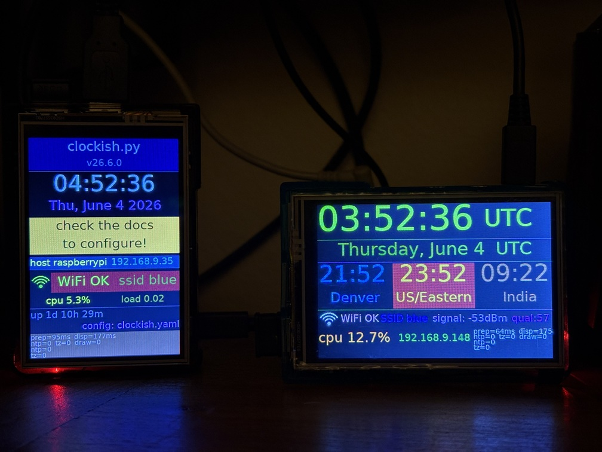
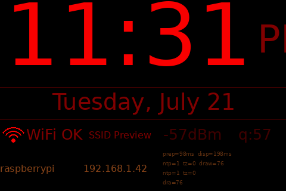
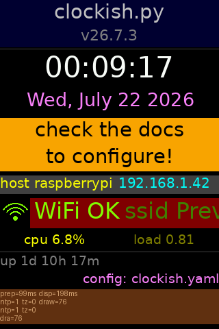
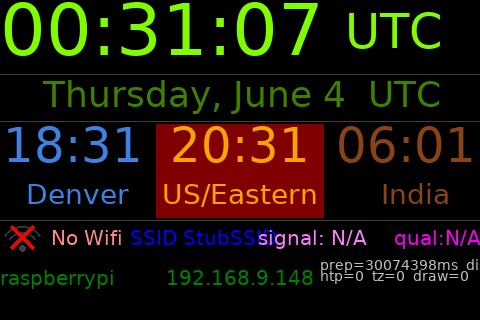
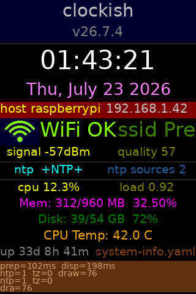
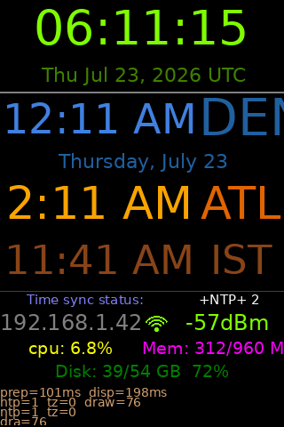
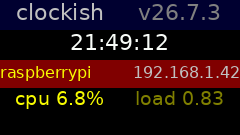
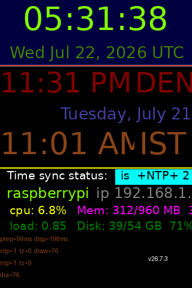
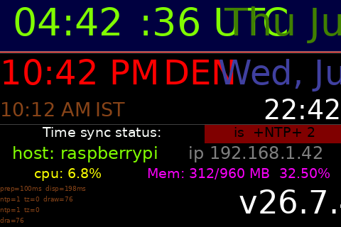

# clockish

Clockish is a customizable clock and _whatever_ display for Raspberry Pi with a PIL compatible display driver. 
It supports multiple "panel" widgets that can show time, date, weather, and more.

Unique in the universe?  Doubtful.  But I had fun making it.

Here's a photo of two raspberry pi's running clockish in portrait and landscape orientations.
The left side one is running the default `clockish.yaml` config, and right side is running `landscape-demo.yaml`.




---
## Table of Contents
- [Overview](#overview)
- [Requirements](#requirements)
- [Installation](#installation)
- [Usage](#usage)
- [Configuration](#configuration)
- [Config previews](#config-previews)
- [License](#license)
- [Contributing / Developing / Nerd and hacker concerns](#contributing--developing--nerd-and-hacker-concerns)

---

## Overview

Clockish drives a small ILI9486-based SPI LCD (the common 3.5" Raspberry Pi display) as a
config-driven dashboard. The layout is defined entirely in YAML: you describe rows of panels,
and each panel shows one thing — a clock, date, system fact, Wi-Fi signal graphic, divider,
or static text. Multiple timezones, font sizes, colors, and panel widths are all controlled
from config with no code changes required.

Target hardware: Raspberry Pi ( original thru pi5, zeros on armv6l, armv7l / aarch64).
Target OS: Raspberry Pi OS or Ubuntu, 32 or 64 bit.
Tested displays:
  - 3.5" ILI9486-based SPI LCD (480x320, 16-bit color).

---

## Requirements

- Python 3.11 or newer
- Raspberry Pi OS Bookworm / Ubuntu 22.04+ (for hardware features)
- On Windows: most features work in a normal venv; GPIO / I²C stubs are skipped

---

## Installation

### On the Raspberry Pi

```bash
git clone https://github.com/YOUR_USERNAME/clockish.git
cd clockish

# Run the bootstrap script — installs system packages, creates the venv,
# copies the default config, and generates the run/edit helper scripts.
bash install.sh
```

That's it.  The script will tell you if a reboot is needed (SPI or group changes).

#### Manual install (if you prefer not to use install.sh)

```bash
python3 -m venv .venv
source .venv/bin/activate
pip install -e .
```

### On Windows (development / preview only)

```powershell
# In PyCharm the venv is usually created automatically.
# If not:
python -m venv .venv
.\.venv\Scripts\Activate.ps1

pip install -e ".[dev]"
```

---

## Usage

After running `install.sh`, three scripts are available at the repo root:

```bash
# Edit your layout config (opens $EDITOR, or nano as fallback):
./edit-clockish-config.sh

# Run the display in the foreground (good for testing a layout):
./run-clockish.sh
./run-clockish.sh configs/big-red.yaml   # try a specific layout
./run-clockish.sh --debug                # show per-frame render timing

# Install as a systemd service — starts on every boot automatically:
./run-clockish.sh --install-service
```

Pass `--debug` to print per-frame timing, or `--debug-layout` to render one frame and exit.

You can also call the installed command directly once the venv is active:

```bash
source .venv/bin/activate
clockish configs/clockish.yaml
clockish --debug-layout configs/big-red.yaml   # render one frame then exit
```

### Generating previews (no hardware required)

`render_preview.py` renders any config to a PNG on any platform — no Raspberry Pi or display needed.

```bash
# Render a single config
python3 src/clockish/render_preview.py configs/system-info.yaml

# Render all configs in configs/ (output goes to docs/previews/)
python3 src/clockish/render_preview.py

# Custom output directory
python3 src/clockish/render_preview.py --outdir /tmp/out configs/big-red.yaml
```

---

## Configuration

Config files live in `configs/`. Each file is a YAML document with two top-level keys:

- **`display`** — `width`, `height`, `rotation` (0 / 90 / 180 / 270)
- **`rows`** — a list of rows, each with a `height` and a `panels` list

Each panel has a `type` and type-specific keys:

| Type           | What it shows                                                                                            |
|----------------|----------------------------------------------------------------------------------------------------------|
| `clock`        | Current time, with optional timezone and 12h/24h format                                                  |
| `date`         | Current date with a `strftime`-style format string                                                       |
| `fact`         | A live system value: `ip`, `hostname`, `uptime`, `cpu`, `mem`, `disk`, `temp`, `ntp_status`, `wifi_*`, … |
| `wifi_graphic` | Animated Wi-Fi signal-strength arcs                                                                      |
| `text`         | Static label                                                                                             |
| `divider`      | Horizontal rule                                                                                          |
| `debug`        | Per-frame render timings (development aid)                                                               |
| `blank`        | Empty space                                                                                              |

See `configs/clockish.yaml` for a fully annotated reference configuration.

---

## Config previews

All images below are generated by `render_preview.py` from the YAML files in `configs/`.

### `big-red.yaml` — bedroom clock (480×320 landscape)
Big 12-hour time in red, date, Wi-Fi status bar, hostname and IP.



---

### `clockish.yaml` — default config (320×480 portrait)
The out-of-the-box config: time, date, network, Wi-Fi graphic, CPU, uptime, and a debug panel.



---

### `landscape-demo.yaml` — landscape demo (480×320)
Multiple panels demonstrating landscape orientation.



---

### `system-info.yaml` — system info (320×480 portrait)
All available fact sources: IP, hostname, uptime, CPU, memory, disk, temp, NTP, Wi-Fi.



---

### `vert-clocks.yaml` — multi-timezone clocks (320×480 portrait)
Several clocks in different timezones stacked vertically, plus system facts below.



---

### `small.yaml` — small display (240×135)
Minimal layout for a tiny screen.



---

### `debug.yaml` — debug portrait (320×480)
Layout focused on the debug timing panel.



---

### `debug-landscape.yaml` — debug landscape (480×320)
Same as above in landscape orientation.



---

## Contributing / Developing / Nerd and hacker concerns

Want to contribute? Head over to [`CONTRIBUTING.md`](./CONTRIBUTING.md) 
for details on project structure, development setup, testing, and how to submit PRs.

---

## License

This project is licensed under the MIT License — see [`LICENSE`](./LICENSE).
Individual files in `third_party/` may carry their own licenses; see each
subdirectory's `LICENSE` file.
